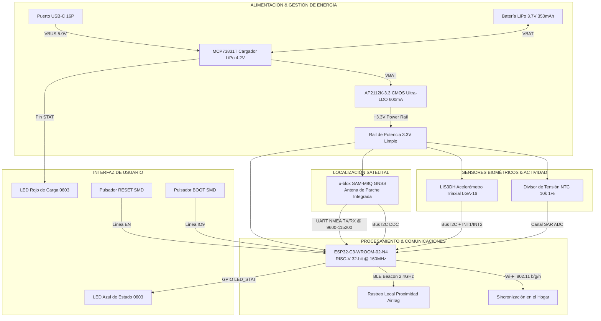

# 🐾 SmartPet — Collar Inteligente para Mascotas (Smart Pet Collar PCB)

[](https://www.kicad.org/)
[](https://github.com/8aChristian/SmartPetCollar-PCB)
[](https://www.ipc.org/)
[](#6-guía-mecánica-y-diseño-del-case-gabinete)
[](LICENSE)

**SmartPet** es una solución de hardware embebido de grado industrial para collares inteligentes de mascotas (*pet wearables*). Diseñado en **KiCad 10**, integra procesamiento ultrarrápido con conectividad **Wi-Fi / Bluetooth Low Energy (BLE)**, posicionamiento satelital **GNSS/GPS con antena de parche integrada**, sensores de **actividad e inclinación triaxial (IMU)**, medición de **temperatura corporal (NTC)** y un sistema completo de **gestión de batería LiPo con recarga USB-C**.

---

## 📸 Vistas del Diseño de PCB

A continuación se presentan las vistas vectoriales de alta resolución del circuito impreso de 2 capas:

| Cara Superior (F.Cu & Serigrafía) | Cara Inferior (B.Cu & Ruteo 45°) |
| :---: | :---: |
|  |  |
| **Top Layer:** ESP32-C3, Módulo GPS, Cargador LiPo, IMU y Conectores | **Bottom Layer:** Sensor NTC, Pistas de Cruce y Plano GND de Retorno |

> 📄 **Documentación Gráfica y Planos de Fabricación:**
> - 🗺️ **Diagrama Esquemático Vectorial (SVG):** [`docs/SmartPet.svg`](docs/SmartPet.svg)
> - 📑 **Layout de PCB con Capas Combinadas (PDF):** [`docs/SmartPet_PCB_Layout.pdf`](docs/SmartPet_PCB_Layout.pdf)
> - 📦 **Paquete Completo de Gerbers RS-274X y Taladros Excellon:** [`fabrication/gerbers/`](fabrication/gerbers/)
> - 📐 **Reglas de Diseño Customizadas para Autorouter:** [`SmartPet.kicad_dru`](SmartPet.kicad_dru)

---

## ⚙️ Clases de Red y Reglas de Ruteo (NetClasses & Autorouter Rules)

El proyecto cuenta con **NetClasses jerárquicas preconfiguradas** según las normas **IPC-2152** e **IPC-2221** para garantizar un ruteo manual o automatizado (*Autorouter / Freerouting*) óptimo:

| Clase de Red (*NetClass*) | Redes Asignadas (*Nets*) | Ancho de Pista (*Width*) | Aislamiento (*Clearance*) | Vía (Diámetro / Taladro) | Función de Ingeniería |
| :--- | :--- | :--- | :--- | :--- | :--- |
| **`Power_Heavy`** | `VBUS`, `VBAT`, `GND` | **$0.80	ext{ mm}$** ($32	ext{ mil}$) | $0.35	ext{ mm}$ ($14	ext{ mil}$) | $arnothing 1.00	ext{ mm}$ / $0.50	ext{ mm}$ | Potencia principal de batería LiPo y bus USB-C (hasta 1.5A) |
| **`Power_Secondary`** | `+3.3V` | **$0.50	ext{ mm}$** ($20	ext{ mil}$) | $0.30	ext{ mm}$ ($12	ext{ mil}$) | $arnothing 0.80	ext{ mm}$ / $0.40	ext{ mm}$ | Riel regulado por LDO AP2112K para ESP32-C3 y sensores |
| **`Signals_Analog`** | `NTC_ADC`, `*ADC*` | **$0.35	ext{ mm}$** ($14	ext{ mil}$) | $0.25	ext{ mm}$ ($10	ext{ mil}$) | $arnothing 0.80	ext{ mm}$ / $0.40	ext{ mm}$ | Señal analógica de temperatura con filtro RC |
| **`Default` / `Digital`** | `I2C_*`, `GPS_*`, `ESP_*`, `USB_*`, `LED_*`, `LIS3DH_*` | **$0.25	ext{ mm}$** ($10	ext{ mil}$) | $0.20	ext{ mm}$ ($8	ext{ mil}$) | $arnothing 0.80	ext{ mm}$ / $0.40	ext{ mm}$ | Buses digitales de alta y media velocidad (I2C, UART, GPIOs) |

---

## 1. 🏗️ Arquitectura General del Sistema



---

## 2. 📋 Selección de Componentes y Justificación Técnica

| Subsistema | Componente | Encapsulado | Función y Justificación de Ingeniería |
| :--- | :--- | :--- | :--- |
| **Cerebro / Conectividad** | **ESP32-C3-WROOM-02-N4** | SMD Module (18x20mm) | SoC RISC-V de 32 bits a 160 MHz con Wi-Fi 4 y Bluetooth 5 (LE). Emite beacons de proximidad (*tipo AirTag*) con consumo en reposo inferior a $5\,\mu	ext{A}$ (*Deep Sleep*). |
| **Receptor GNSS/GPS** | **u-blox SAM-M8Q** | 15.5 x 15.5 mm | Módulo GPS/GLONASS/Galileo miniatura con **antena de parche cerámica integrada de fábrica**. Ahorra más del 70% de espacio en PCB y suprime la necesidad de líneas microstrip de 50Ω. |
| **Sensor de Movimiento** | **LIS3DH** | LGA-16 (3x3 mm) | Acelerómetro triaxial de ultra-bajo consumo ($2\,\mu	ext{A}$ en modo low-power) para monitoreo de actividad física, sueño y detección de caídas con interrupción por umbral. |
| **Temperatura Corporal** | **NTC 10k 1% (TH1)** | SMD 0603 | Termistor de precisión acoplado a un divisor resistivo con filtro RC ($10	ext{ nF}$) conectado al canal SAR ADC interno del ESP32-C3. |
| **Gestión de Carga** | **MCP73831T-2ACI/OT** | SOT-23-5 | Cargador lineal LiPo monocelda (4.2V), configurado a corriente de carga $I_{CHG} = 300	ext{ mA}$ mediante $R_{PROG} = 3.3	ext{ k}\Omega$. |
| **Regulación LDO** | **AP2112K-3.3TRG1** | SOT-23-5 | Regulador LDO CMOS de 600mA con caída ultra-baja ($V_{drop} pprox 250	ext{ mV}$ a 600mA), garantizando estabilidad frente a los picos de RF del Wi-Fi. |
| **Conector de Recarga** | **USB-C 16-pin (GCT USB4105)** | SMD Top-Mount | Puerto de recarga universal con resistencias pulldown de $5.1	ext{ k}\Omega$ en pines CC1 y CC2 según estándar USB Type-C Power Delivery. |
| **Conector de Batería** | **JST-SH 1.0mm 2-pin** | SMD Horizontal | Conector ultracompacto con bloqueo para celda de polímero de litio 1S (3.7V, 300–400 mAh). |

---

## 3. ⚡ Topología de Potencia y Supresión de Ruido

1. **Desacoplo en Trayectoria Directa**:
   - Cada circuito integrado cuenta con condensadores de desacoplo ($C_{IN}, C_{OUT}$) ubicados directamente en la entrada de sus pines de alimentación antes de cualquier bifurcación.
2. **Filtrado Analógico del ADC**:
   - El nodo de lectura del divisor NTC incorpora un filtro paso bajo pasivo ($R = 10	ext{ k}\Omega, C = 10	ext{ nF}, f_c pprox 1.59	ext{ kHz}$) para inmunidad contra el ruido de conmutación digital.
3. **Plano de Tierra Analógico/Digital Unificado**:
   - Ambos lados de la placa (F.Cu y B.Cu) están cubiertos por un plano de tierra GND continuo con conexiones térmicas (*thermal reliefs*).

---

## 4. 📐 Reglas de Ruteo y Normas DFM (IPC-2152)

- **Prohibición Estricta de Ángulos de 90°**: Todas las pistas utilizan biseles a **45° (*45-degree mitered chamfering*)** o arcos suaves para prevenir trampas de ácido (*acid traps*) y saltos capacitivos.
- **Despeje al Borde de la Placa (*Edge Pullback*)**: Mínimo de $\ge 1.0	ext{ mm}$ entre cualquier elemento de cobre y el contorno exterior `Edge_Cuts`.
- **Zona de Exclusión de Antena (*RF Keepout Area*)**:
  - El área superior de la antena de traza del ESP32-C3 ($Y < 56.5	ext{ mm}$) se mantiene **100% libre de pistas y planos de cobre** en ambas capas para maximizar el alcance de RF.

---

## 5. 📦 Lista de Materiales (Bill of Materials - BOM)

| Ref Des | Cantidad | Valor / Descripción | Encapsulado | Fabricante / MPN Sugerido |
| :--- | :---: | :--- | :--- | :--- |
| **U1** | 1 | ESP32-C3-WROOM-02-N4 (RISC-V BLE/WiFi) | Module SMD | Espressif ESP32-C3-WROOM-02-N4 |
| **U2** | 1 | MCP73831T-2ACI/OT (LiPo Charger 4.2V) | SOT-23-5 | Microchip MCP73831T-2ACI/OT |
| **U3** | 1 | AP2112K-3.3TRG1 (LDO 3.3V 600mA) | SOT-23-5 | Diodes Inc. AP2112K-3.3TRG1 |
| **U4** | 1 | LIS3DH (Acelerómetro Triaxial I2C/SPI) | LGA-16 (3x3mm) | STMicroelectronics LIS3DHTR |
| **U5** | 1 | SAM-M8Q (Receptor GNSS con Antena) | 15.5x15.5mm | u-blox SAM-M8Q-0-10 |
| **J1** | 1 | Conector Batería LiPo 1S 1.0mm | JST-SH 2P SMD | JST SM02B-SRSS-TB |
| **J2** | 1 | Conector USB-C 16-Pines Power Only | Top-Mount SMD | GCT USB4105-GF-A |
| **SW1, SW2** | 2 | Pulsador Táctil SMD (Reset / Boot) | 4-Pin SMD | E-Switch TL3342F160QG |
| **D1** | 1 | LED SMD Rojo (Indicador de Carga) | 0603 Metric | Lite-On LTST-C190KRKT |
| **D2** | 1 | LED SMD Azul (Estado / BLE) | 0603 Metric | Lite-On LTST-C190TBKT |
| **TH1** | 1 | Termistor NTC 10k 1% B=3950K | 0603 Metric | Murata NCP18XH103F03RB |
| **R1** | 1 | 3.3kΩ 1% (R_PROG 300mA) | 0603 Metric | Yageo RC0603FR-073K3L |
| **R2, R11** | 2 | 1.0kΩ 5% (LED Resistors) | 0603 Metric | Yageo RC0603JR-071KL |
| **R3, R4** | 2 | 5.1kΩ 1% (USB-C CC1/CC2 Pulldown) | 0603 Metric | Yageo RC0603FR-075K1L |
| **R5, R6** | 2 | 10kΩ 5% (Pullups EN / Boot) | 0603 Metric | Yageo RC0603JR-0710KL |
| **R7, R8** | 2 | 4.7kΩ 1% (Pullups Bus I2C) | 0603 Metric | Yageo RC0603FR-074K7L |
| **R9** | 1 | 10kΩ 0.1% / 1% (Divisor NTC) | 0603 Metric | Yageo RC0603FR-0710KL |
| **C1, C2, C3**| 3 | 4.7μF 10V X5R/X7R Ceramic | 0603 Metric | Murata GRM188R61A475KE15D |
| **C4, C5, C7, C8** | 4 | 0.1μF 16V X7R Ceramic | 0603 Metric | Murata GRM188R71C104KA01D |
| **C6** | 1 | 10nF 25V X7R Ceramic (Filtro NTC) | 0603 Metric | Murata GRM188R71E103KA01D |

---

## 6. 🦮 Guía Mecánica y Diseño del Case / Gabinete (IP67)

Para garantizar la durabilidad y precisión de las lecturas en una mascota:

1. **Orientación de la Antena GPS (U5)**:
   - La cara superior del módulo GPS debe apuntar **hacia el cielo** (hacia el exterior del collar). El material de la carcasa superior debe ser de plástico dieléctrico homogéneo (ABS, PETG, TPU o Policarbonato) **sin partes metálicas ni baterías sobre el módulo**.
2. **Acoplamiento Térmico del Termistor (TH1)**:
   - TH1 está ubicado en la cara inferior de la PCB. La carcasa debe contar con un **remache o contacto metálico de acero inoxidable** con silicona conductora térmica en contacto con el pelaje/piel de la mascota para medir la temperatura real del animal.
3. **Resistencia al Agua (IP67)**:
   - Utilizar una junta de goma/silicona (*O-ring*) en el cierre perimetral de la caja con 4 tornillos de acero inoxidable M2.
   - El puerto USB-C (J2) debe protegerse con una **tapa hermética de silicona** cautiva en la carcasa.
4. **Guías de Luz (*Light Pipes*)**:
   - Usar cilindros de policarbonato translúcido para canalizar los LEDs D1 y D2 hacia la superficie del case sin abrir orificios de entrada de agua.

---

## 7. 🚀 Instrucciones de Fabricación y Apertura

### Apertura en KiCad 10
1. Clonar el repositorio:
   ```bash
   git clone https://github.com/8aChristian/SmartPetCollar-PCB.git
   ```
2. Abrir el archivo `SmartPet.kicad_pro` en **KiCad 10.0+**.
3. Presionar `Alt + 3` para abrir el Visor 3D nativo.

### Fabricación Industrial (JLCPCB / PCBWay)
1. Los archivos Gerber listos para producción se encuentran en [`fabrication/gerbers/`](fabrication/gerbers/).
2. Comprimir el contenido de la carpeta `fabrication/gerbers/` en un archivo `.zip` y cargarlo en la plataforma de manufactura.
